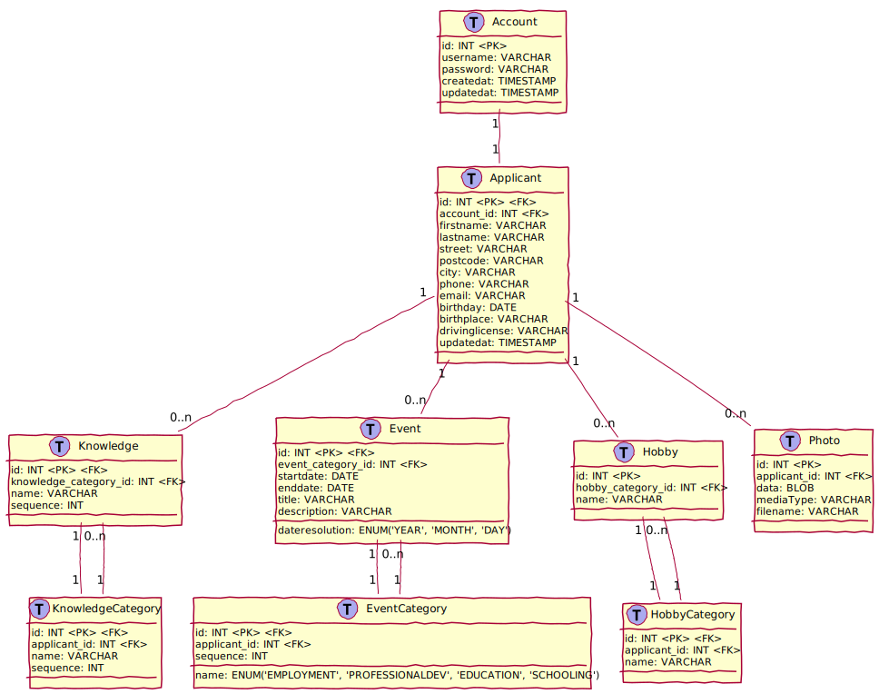
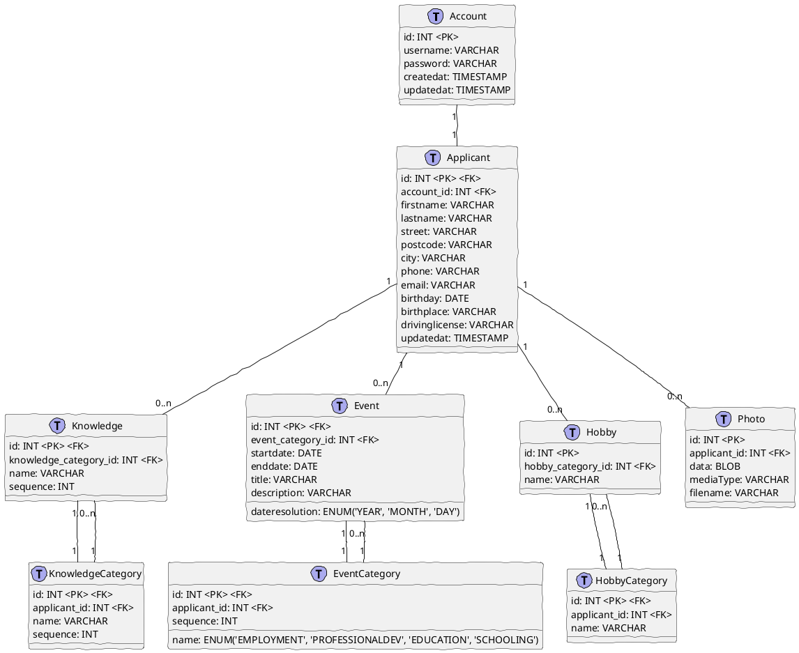

# JEE Applikation zur Bewerbung bei PROLICHT

## Konfiguration

Zum Start der WebApplikation (in aktueller Fassung) müssen die Umgebungsvariablen **PROLICHTUSER** und **PROLICHTPASSWORD** gesetzt sein.

## Datenmodell

