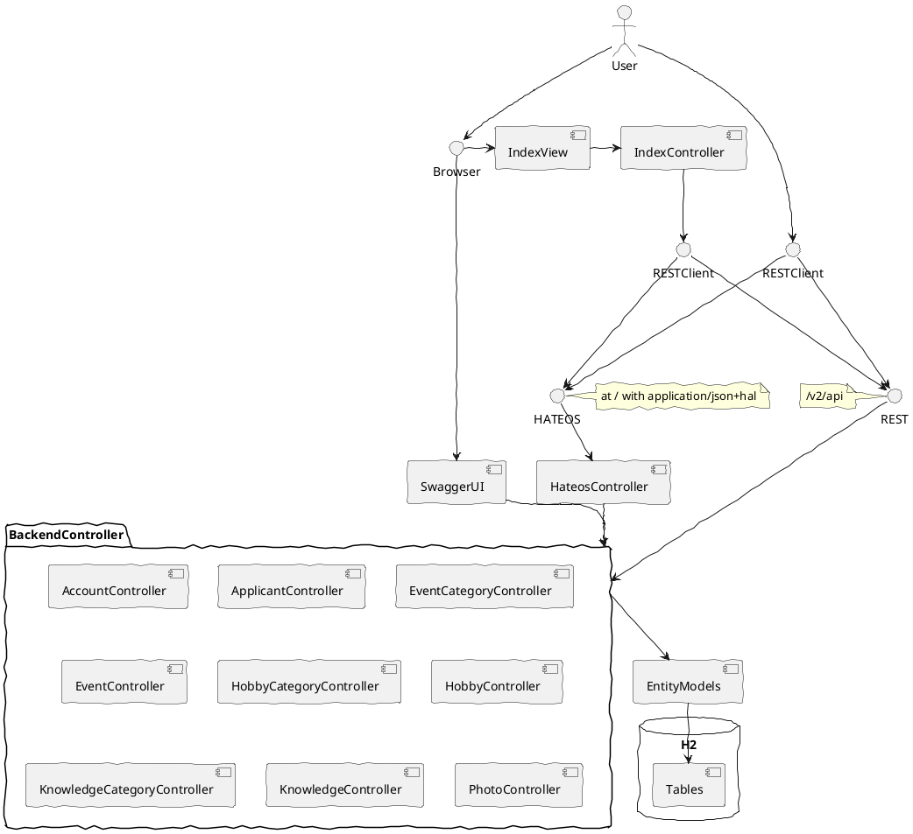
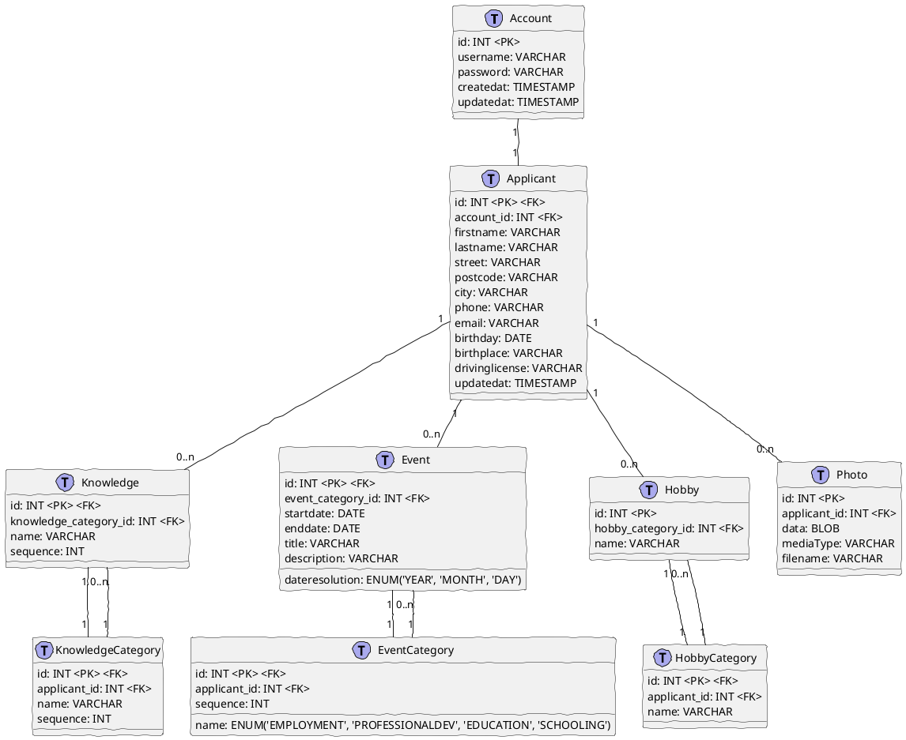

# JEE Applikation zur Bewerbung bei PROLICHT

## Beschreibung

Eine auf SpringBoot basierende JEE-Webapplikation zur Generierung eines Online-Lebenslaufes.
Im Prinzip ein leichtgewichtiges, einfaches, sehr spezialisiertes ContentManagementSystem (CMS) mit Bearbeitung von in Datenbank hinterlegten Daten über REST Webservice (JSON+HAL).
Das Datenbank-Backend, das Webservice-Backend, der Webservice-Client und das Webapplikations-Frontend sind in einer Applikation zusammengefasst.
Die Webservice-API ist mit Hilfe von Swagger dokumentiert und über **/v2/api-docs** abrufbar.
Außerdem steht das Swagger-UserInterface unter **/swagger-ui.html** zur Verfügung.

Da dies nur eine Art **Proof-Of-Concept** oder Möglichkeitsstudie ist, sind weder Benutzeradministration noch Mehrmandantenfähigkeit komplett integriert.

Die Applikation veranschaulicht die Funktionsweise von Spring(Boot) bei REST-Webservices und JPA und Freemarker-Templates.

## Konfiguration

Zum Start der WebApplikation (in aktueller Fassung) müssen die Umgebungsvariablen **PROLICHTUSER** und **PROLICHTPASSWORD** gesetzt sein.
Mit diesem Benutzer/Passwort kann auf per HTTPBasicAuth abgesicherte APIs zugegriffen werden.

## Architektur

## Datenmodell

