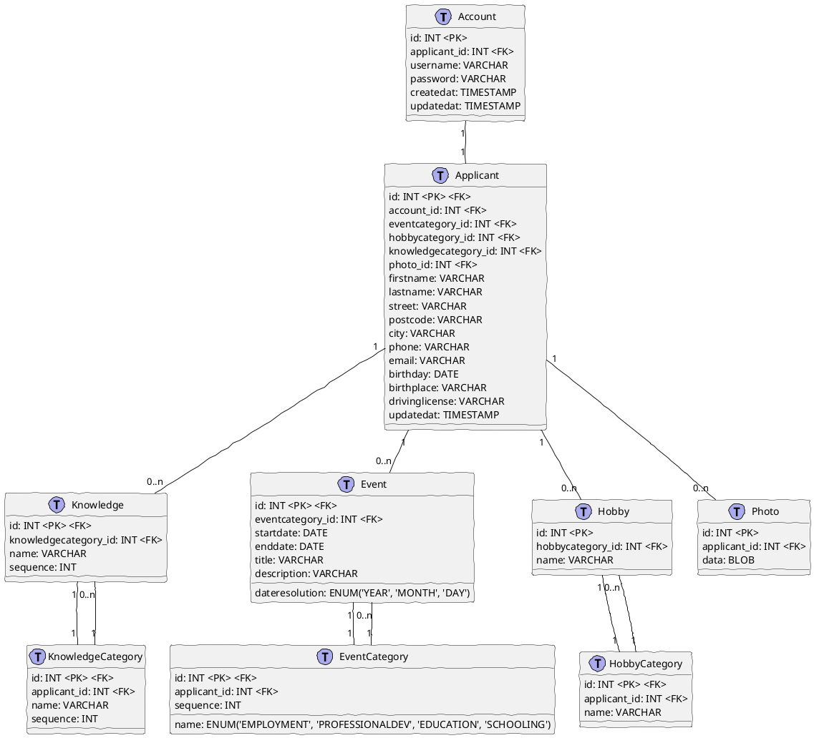

# JEE Applikation zur Bewerbung bei PROLICHT

## Datenmodell

```plantuml
@startuml
skinparam handwritten true

!define table(x) class x << (T,aaaaee) >>

table(Account) {
    id: INT <PK>
    applicant_id: INT <FK>
    username: VARCHAR
    password: VARCHAR
    createdat: TIMESTAMP
    updatedat: TIMESTAMP
}

table(Applicant) {
    id: INT <PK> <FK>
    account_id: INT <FK>
    eventcategory_id: INT <FK>
    hobbycategory_id: INT <FK>
    knowledgecategory_id: INT <FK>
    photo_id: INT <FK>
    firstname: VARCHAR
    lastname: VARCHAR
    street: VARCHAR
    postcode: VARCHAR
    city: VARCHAR
    phone: VARCHAR
    email: VARCHAR
    birthday: DATE
    birthplace: VARCHAR
    drivinglicense: VARCHAR
    updatedat: TIMESTAMP
}

table(Knowledge) {
    id: INT <PK> <FK>
    knowledgecategory_id: INT <FK>
    name: VARCHAR
    sequence: INT
}

table(KnowledgeCategory) {
    id: INT <PK> <FK>
    applicant_id: INT <FK>
    name: VARCHAR
    sequence: INT
}

table(Event) {
    id: INT <PK> <FK>
    eventcategory_id: INT <FK>
    startdate: DATE
    enddate: DATE
    dateresolution: ENUM('YEAR', 'MONTH', 'DAY')
    title: VARCHAR
    description: VARCHAR
}

table(EventCategory) {
    id: INT <PK> <FK>
    applicant_id: INT <FK>
    name: ENUM('EMPLOYMENT', 'PROFESSIONALDEV', 'EDUCATION', 'SCHOOLING')
    sequence: INT
}

table(Hobby) {
    id: INT <PK>
    hobbycategory_id: INT <FK>
    name: VARCHAR
}

table(HobbyCategory) {
    id: INT <PK> <FK>
    applicant_id: INT <FK>
    name: VARCHAR
}

table(Photo) {
    id: INT <PK>
    applicant_id: INT <FK>
    data: BLOB
}

Account "1" -- "1" Applicant

Applicant "1" -- "0..n" Knowledge

Applicant "1" -- "0..n" Event

Applicant "1" -- "0..n" Hobby

Applicant "1" -- "0..n" Photo

Knowledge "1" -- "1" KnowledgeCategory
KnowledgeCategory "1" -- "0..n" Knowledge

Event "1" -- "1" EventCategory
EventCategory "1" -- "0..n" Event

Hobby "1" -- "1" HobbyCategory
HobbyCategory "1" -- "0..n" Hobby

@enduml
```
